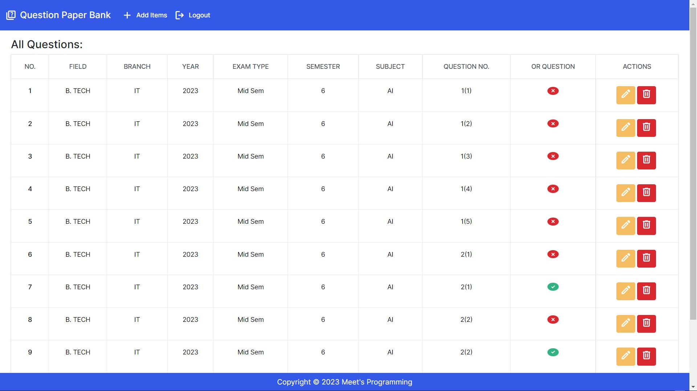
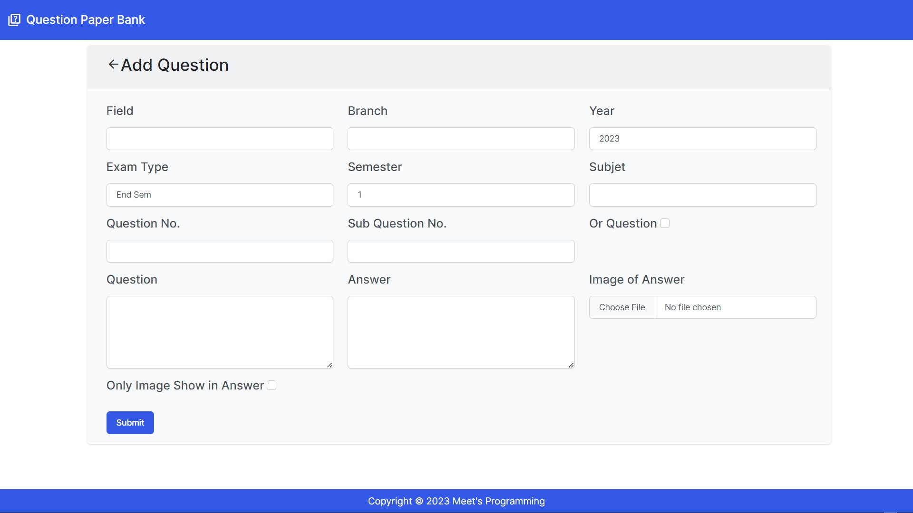

# Exam Question Managment application

## Setup

The first thing to do is to clone the repository:

```sh
$ git clone https://github.com/MeetSherasiya/Exam_question_blog.git
$ cd Exam_question_blog
```

Create a virtual environment to install dependencies in and activate it:

```sh
$ virtualenv --no-site-packages env
$ source env/bin/activate
```

Then install the dependencies:

```sh
(env)$ pip install -r requirements.txt
```
Note the `(env)` in front of the prompt. This indicates that this terminal
session operates in a virtual environment set up by `virtualenv`.

Once `pip` has finished downloading the dependencies:
```sh
(env)$ cd Exam_question_blog
(env)$ python manage.py runserver
```
And navigate to `http://127.0.0.1:8000/`.

## User View

<p>Question Page</p><br>

<br>
<p>Answer Page View</p><br>

<br>

## Admin View
<p>Admin Home Page</p><br>

<br>
<p>New Question Add Page</p><br>


